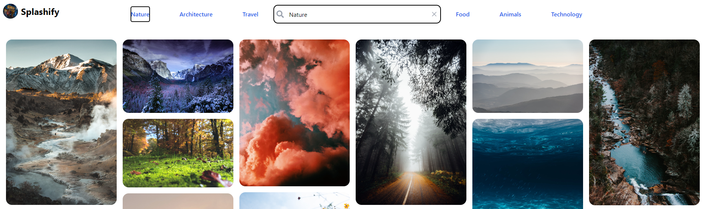

# Splashify
Splashify is a React + TypeScript + Vite application that allows users to search and browse high-resolution images using the Unsplash api. It provides a user-friendly interface and useful features such as image filtering and sorting.

Users can enter a search query and the app will fetch and display matching photos. The app also supports infinite scrolling, where more photos are loaded as the user scrolls down the page.

## Table of Contents
- [Features](#features)
- [Technologies](#technologies)
- [Features](#features)
- [Installation](#installation)
	- [Production](#production)
	- [Local](#local)
- [Usage](#usage)
- [To do](#todo)
- [Challenges](#challenges)

## Features
- Search and browse high-resolution images from Unsplash
- Users will be shown Trending images by default and can select New images from the drop-down menu in the header
- View image author, number of likes and download image upon hover
- Image modal with full size image and detailed information about the image and author
- Masonry grid layout for better visual organization
- Infinite scrolling for seamless browsing experience
- Clear your search with `x` button to default to Trending images

## Technologies

| Technology        | Description                                                      |
| ----------------- | ---------------------------------------------------------------  |
| React             | JavaScript library for building user interfaces                  |
| TypeScript        | Primary language for programming                                 |
| axios             | Making API requests                							   |
| Tailwind CSS      | CSS framework for custom design                                  |
| react-masonry-css | Responsive masonry layout for grid view in React                 |
| usehooks-ts       | Collection of TypeScript utility hooks                           |
| Vite              | Build tool                                                       |
| VS Code           | Code editor and terminal                                         |
| Github            | Code repository and documentation                                |
| Vercel            | Live web deployment                                              |

## Installation
### Production
Please visit the following link to view the live version of this application online:
- [Splashify](https://splashify.vercel.app/)

Please note: API requests are limited to 50 per hour from Unsplash while application is in the process of being approved for Production.
- Due to this, images may not appear if too many requests are made. Please be patient as the application is approved.

### Local

**Pre-requisites:**
- Node.js
- npm
- Git
- Unsplash API developer key

To run the application locally, follow these steps:

1.  Open your terminal. If you're using VS Code (recommended), you can open the integrated terminal by pressing Ctrl + '
    
2.  Confirm that you have Git installed by typing `git --version`. If you don't have Git installed, download and install it from [here](https://git-scm.com/downloads).
    
3.  Clone the repository using Git: `git clone https://github.com/basinghse/splashify.git (can enter optional-new-name)`
    
4.  Navigate to the project directory: `cd (splashify or optional-new-name)`
    
5.  Install dependencies: `npm install`
    
6.  Replace the `client_id` value in the `config.ts` file with your Unsplash Access Key. You can obtain your Access Key by creating a developer account on the Unsplash website and creating a new application. Follow [this guide](https://unsplash.com/documentation#creating-a-developer-account)
    
7.  Run the application: `npm run dev`
    
    This will start a local development server at your local host e.g. `http://localhost:5173/` Follow the link provided (i.e. `ctrl + click`)
	In a rare situation where there is an error in the code - there may be dependencies missing in the installation. In this case, you may need to reinstall the dependencies, or refer to the error message.

That's it! You should now be able to use the Splashify app locally.

## Usage
1. Enter a search term into the search bar
2. Wait a moment for the results to populate
3. The search results will be display relevant images from unsplash in a grid view (via masonry)
4. Hover over an image and select the download button to download the image
5. Click on any image to view it in full size

## Todo
- [x] Display popular search phrases from the Unsplash API to give users search ideas.

## Challenges

- [x] **Challenge:** Fetching a mix of portrait and landscape images from Unsplash API.
- **Solution:** Made two separate API calls for portrait and landscape images, then merged the results and randomized the order using the `shuffleArray` function.

- [x] **Challenge:** Implementing infinite scrolling.
- **Solution:** Used the `IntersectionObserver` API to detect when the user reaches the bottom of the page and fetch more images.

- [x] **Challenge:** Preventing body scroll when the image modal is open.
- **Solution:** Added and removed the `overflow-hidden` class to the body element when the modal is opened and closed, respectively.

- [x] **Challenge:** Displaying trending words from the Unsplash API.
- **Solution:** Fetched the trending topics using the Unsplash API and displayed them as clickable buttons that update the search query.

- [ ] **Challenge:** When selecting the 'popular searches' buttons - sometimes it won't load the selected search
- This appears to be due to the API fetching limitation. Once it hits the limit, the site may fluctuate between images it has already published, as it cannot fetch any new images.
- It also appears that if the popular searches are clicked one after another, sometimes the second button will not change the images, and due to that, the next button selections will produce the images for the previous search e.g. Nature selection - successful; Architecture selection - unsuccessful; Travel selection - will now show Architecture images; Food selection - will now display Travel images; etc. The **solution** to this is to keep interchanging between the different buttons until the images correspond with the correct buttons. I believe this will be resolved with a higher limit on API fetching through Unsplash API Production account.