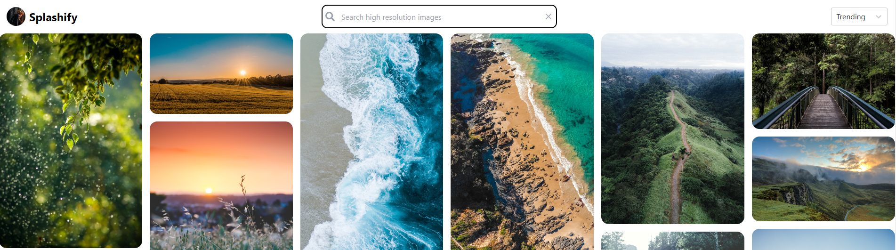

# Splashify
Splashify is a React + TypeScript + Vite application that allows users to search and browse high-resolution images using the Unsplash api. It provides a user-friendly interface and useful features such as image filtering and sorting.

Users can enter a search query and the app will fetch and display matching photos. The app also supports infinite scrolling, where more photos are loaded as the user scrolls down the page.

## Table of Contents
- [Features](#features)
- [Technologies](#technologies)
- [Features](#features)
- [Installation](#installation)
	- [Demo](#demo)
	- [Local](#local)
- [Usage](#usage)
- [To do](#todo)
- [Challenges](#challenges)

## Features
- Search and browse high-resolution images from Unsplash.
- Find trending and new images from Unsplash.
- View image author, number of likes and download image upon hover
- Image modal with full size image and detailed information about the image and author.
- Masonry grid layout for better visual organization.
- Infinite scrolling for seamless browsing experience.

## Technologies
**- React** - a JavaScript library for building user interfaces
**- TypeScript** - primary language for programming
**- axios**: a promise-based HTTP client for making API requests
**- react-masonry-css**: a responsive masonry layout for React
**- usehooks-ts**: a collection of TypeScript utility hooks
**- Vite** - build tool
**- VS Code** - code editor and terminal
**- Github** - code repository and documentation
**- Vercel** - live web deployment

## Installation
### Production
Please visit the following link to view the live version of this application online:
- [Splashify](https://splashify.vercel.app/)

### Local
To run the application locally, follow these steps:

1.  Open your terminal. If you're using VS Code (recommended), you can open the integrated terminal by pressing `Ctrl + ``.
    
2.  Confirm that you have Git installed by typing `git --version`. If you don't have Git installed, download and install it from [here](https://git-scm.com/downloads).
    
3.  Clone the repository using Git: `git clone https://github.com/basinghse/splashify.git`
    
4.  Navigate to the project directory: `cd splashify`
    
5.  Install dependencies: `npm install`
    
6.  Replace the `client_id` value in the `config.ts` file with your Unsplash Access Key. You can obtain your Access Key by creating a developer account on the Unsplash website and creating a new application. Follow [this guide](https://unsplash.com/documentation#creating-a-developer-account)
    
7.  Run the application: `npm run dev`
    
    This will start a local development server at your local host e.g. `http://localhost:5173/` Follow the link provided (i.e. ctrl + click)

That's it! You should now be able to use the Splashify app locally.

## Usage
To search for images, simply type your query into the search bar and the results will populate after a short delay. The application will fetch relevant images from Unsplash and display them in a masonry grid layout.

Apart from searching, you can also view Trending (default) or New images using the drop-down menu in the header.

## Todo
- [ ] Display popular search phrases from the Unsplash API to give users search ideas.

## Challenges

- [x] **Challenge:** Fetching a mix of portrait and landscape images from Unsplash API.
- **Solution:** Made two separate API calls for portrait and landscape images, then merged the results and randomized the order using the `shuffleArray` function.

- [x] **Challenge:** Implementing infinite scrolling.
- **Solution:** Used the `IntersectionObserver` API to detect when the user reaches the bottom of the page and fetch more images.

- [x] **Challenge:** Preventing body scroll when the image modal is open.
- **Solution:** Added and removed the `overflow-hidden` class to the body element when the modal is opened and closed, respectively.
